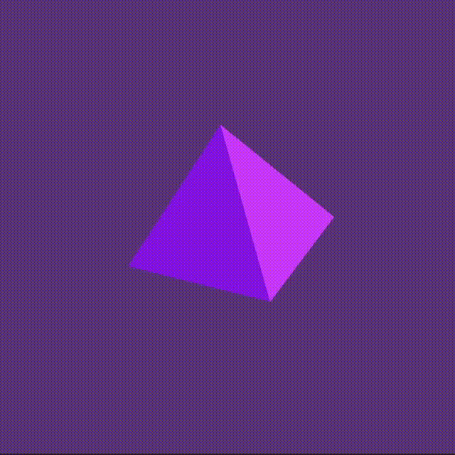

Lately I've been really hankering for a good framework to work on procedurally generated art. I remember I used to have a great time in middle school playing [Processing](https://processing.org/) and was wondering if there were any tools that might be better suited to my present-level maturity as a programmer and which utilized a language I like (not java). I came across [nannou](https://nannou.cc/) which also delivered on some additional nice-to-haves:
- ability to use an editor of my choice / integrate with copilot because I'm lazy
- all-in-one framework without the need to run external services or necessarily rely on the browser
- decent level of documentation since I haven't done stuff like this since I was 12

After messing around with the tutorials, I got to know the very basic points of nannou's framework, and decided to try and copy something I did from back in middle school:

```rust
extern crate nannou;
use nannou::prelude::*;

fn main() {
    nannou::app(model).run();
}

struct Model {}

fn model(app: &App) -> Model {
    app.new_window().size(512, 512).view(view).build().unwrap();
    Model {}
}

fn view(app: &App, _model: &Model, frame: Frame) {
    // Prepare to draw.
    let draw = app.draw();

    if app.elapsed_frames() % 60 == 0 {
        draw_pyramid(&draw);
    }

    draw.to_frame(app, &frame).unwrap();
}

fn draw_pyramid(draw: &Draw) {
    let background_color = random_rgb();
    let tri_face_one_color = random_rgb();
    let tri_face_two_color = random_rgb();

    // Draw a pyrmaid in perspective with 2 2d triangles
    draw.translate(vec3(-75.0, -15.0, 0.0))
        .tri()
        .points(vec2(0.0, 0.0), vec2(100.0, -25.0), vec2(65.0, 100.0))
        .color(tri_face_one_color);
    draw.translate(vec3(-75.0, -15.0, 0.0))
        .tri()
        .points(vec2(100.0, -25.0), vec2(145.0, 35.0), vec2(65.0, 100.0))
        .color(tri_face_two_color);

    draw.background().color(background_color);
}

fn random_rgb() -> Rgb {
    let r = random_f32();
    let g = random_f32();
    let b = random_f32();
    rgb(r, g, b)
}
```

What this does is render a simple in-perspective pyramid with the colors of all the distinct shapes changing *about* once a second. In order to get it to the same level of complexity I had implemented with Processing when I was 12 would need to:
- learn about transformations in nannou so that I can tile a bunch of lil pyramids across my canvas
- learn about implementing Models with nannou so that I can track each pyramid as a part of application state
but I'm saving that for another day!

In the meantime, this is the current output of my code:



I hope you enjoyed my weekend experiment. I look forward to making more complex digital art as I get better with nannou!

If you want you can take a look at [the repo](https://github.com/amiller68/pyramid-scheme) behind this work. Thanks for reading!


 