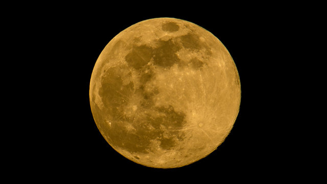

i woke up to a harvest moon. yellow hanging draped in the hallowed-disc light

the waves, without word, lapping at the shore far below

beams refract yearning to return high and captured by the bay

round yellow ethereal light lulls me from my sleep

to witness in suspect mysteries

but i am held

