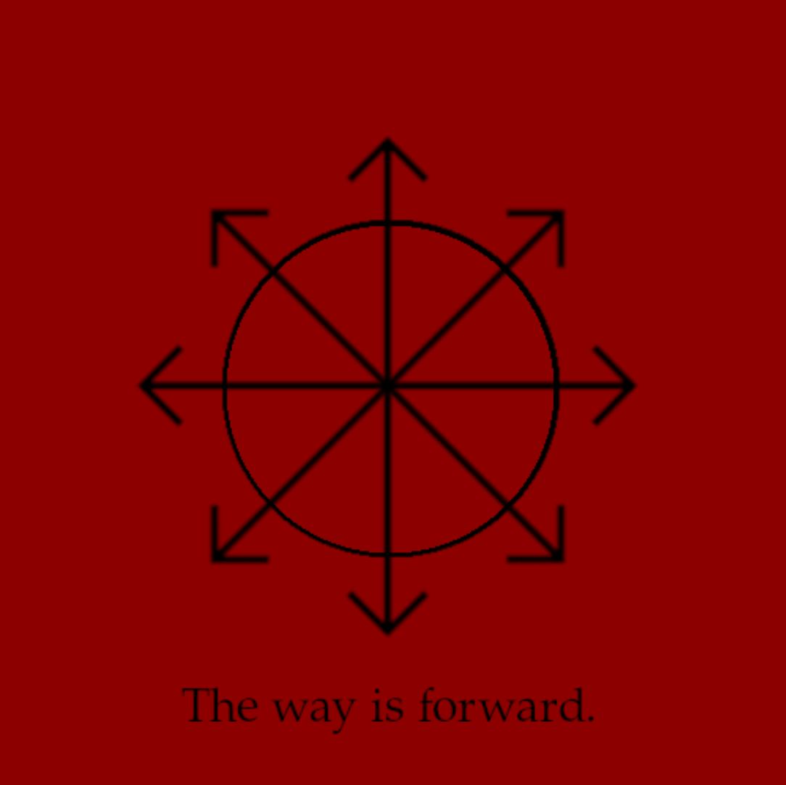

[^1]

# Oh, Humanity!

“”What prepares men for totalitarian domination in the non-totalitarian world is the fact that loneliness, once a borderline experience usually suffered in certain marginal social conditions like old age, has become an everyday experience of the ever growing masses of our century.[^2]

In The Human Condition, Arendt writes that “men in so far as they live in and move and act in the world, can experience meaningfulness only because they can talk with and make sense to each other and themselves.” On account of this, it was Arendt’s opinion that the modern age would serve to rend the bonds holding humanity together -- the advances of technology and science separate humanity from the necessity of labor and its ties to the natural world. Concurrently, the demands of modern existence creates a society of laborers centered around Capitalist production. For all previous centuries of human existence, “toil and trouble” had been the necessary prerequisites to achieving higher aims in life -- love, friendship, philosophy, etc. Modern humanity is the first generation to free themselves from such requirements, from labor, “but this society no longer knows of those higher and more meaningful activities for the sake of which this freedom would deserve to be won.” The society of laborers is freed from labor, “the only activity left for them.”[^3]

Adrendt, writing in 1958, tells us that such a society is entailed in the arrival of the “future man,” who will make his appearance in the next hundred years or so. Yet, there is something of him being made now, and there was something of being made then. On the one hand, we can look at the bewildering experience of modern laborers and consumers. The emergence of the commodity is notable in this regard, in de-specifying the relation between producer and consumer in favor of a reliance on abstract exchange value. On the other hand, we can look at the structure of the communities in which we live. The family or local group has ceased to provide the same comforts and meanings that it once did. Where reproduction and socialization had once met engaging with one's neighbors or family, the modern individual has no compulsion or requirement to engage in such socialization. Ironically, even as our reproduction has become more socialized and globalized, we are empowered to approach the world ever more as atomized individuals. In either sense, the future man is being made presently in the modern world by virtue of his growing capabilities to free himself from the particularities of production and meaningful interaction with others.

Perhaps then, Arendt was wrong in delaying the arrival of future man to forty years from now -- certainly he has already started to appear. As such, he is not primarily presupposed on a miraculous liberation of humanity from the restraints of the physical world, but on a growing divide between humans and their ability to impart meaningful effects on the world. As de Beauvoir writes:

Human society is an anti-physis: it does not passively submit to the presence of nature, but rather appropriates it. This appropriation is not an interior, subjective operation: it is carried out objectively through praxis.[^4]

De Beauvoir here is discussing the formation of the categories “man” and “woman” as a reflection of humanity's encounter with physical difference in biology; man made women into an “othered” being precisely because sexual difference allowed it, and the requirements of the physical world required it. Yet, it is through this process of othering woman that man understands himself -- “the Other, who limits and denies him, is ... necessary for him: he attains himself only through the reality he is not.”[^5] Applying the same reasoning here, on the relation between men and women, to the experience of the individual in the world, we can claim that the arrival of the future man is not a product of utopian science -- at least not solely. Rather, he arrives at the point when his actions cease to distinguish himself from the surrounding body, and his self is lost in a mass of human futility; to no small extent, he has already arrived.

It is my opinion that this vantage point offers itself as a prime lens through which to understand the formation of Arendt’s mass man and mass consciousness in the totalitarian society, as described in The Origins of Totalitarianism. By Arendt’s prior suggestion and de Beuavoir’s theory of the relation between the self and world through praxis, the problem of the modern age is its paltry opportunities for the realization of the self -- instead, it offers a bewildering array of commodities and structures that only serve to create distance between us. As such, the individual is dominated, isolated, and lonely -- left without some group or identity with which to premise their actions, they are ripe for incorporation into the developing “mass man.” Left without place, home, or distinction, the individual must find a meaningful sphere of action in the combined energies of their isolated peers; together they make the foundations for the totalitarian movement.[^6] It is such atomization and alienation in which the Germans were able to congeal under the banner of the Third Reich; and it is still growing today.

It is in the grasp of the totalizing institution that the lost individual is once again able to claim access to a world in which to act. Subsumed in the combined will of their peers, the individual’s will -- their will to power, to extend, to exist -- becomes synonymous with that of the institution. At the same time, the reality of the totalized society provides them with an actionable goal -- “the elimination of ever non-totalitarian reality.” Every damned spot in the universe that would serve to question the fiction which upholds the bewildered mass -- that the individual’s transcendence has been placed within an institution that otherwise only values them as an obedient cog -- must be destroyed.[^7] As de Beuavoir writes, “when the city of the state devours the citizen, he is no longer in any position to deal with his personal destiny” -- so too does the lost individual, in becoming part of the mass, forfeit their own destiny in favor of realizing themselves in the pursuit of totalitarian projects.[^8]

Thus made, the totalized individual is prepared to carry out the ultimate goal of the totalitarian society -- expansion. Where once Imperialism was spurred on by the demands of Capital, the totalitarian society extends itself “to make the world consistent, to prove that its respective supersense has been right.”[^9] Today, the goal is global conquest; as such totalitarian expansion contains within it the same contradictions that Imperialism once did -- surely the movement should falter once it reaches the limits of its earthly plain and realizes that it cannot, in fact, annex the stars. But today’s limitations melt under the relentless march of time and power manifest in the mass man ... growing day by day.

*************************************

From: Section Head, Almagest, Alpha Centauri System To: HT-333756

Congratulations HT-333756. You’re being promoted. Report to Almagest for shore leave and officer’s orientation. More instructions on arrival.

Best, Ames

******************************************************************************************

The new lieutenant, trooper designation HT-333756, looked at the letter again. They had just returned to their new quarters from their officers’ orientation meeting with Admiral Ames.[^10] Their promotion had followed a particularly intense campaign throughout the outer reaches of the star system, during which they had been obliged to take command of their platoon.

The Lieutenant grimaced as they thought about that second drop on Site Alpha. The platoon’s Captain had warned them that the opposition had started using new hardware. But they had not been prepared to see half their squad dissolve in an instant of hitting the ground-- becoming incorporated in the bellowing, gaseous atmosphere of the planet. It had only been by sheer luck that the Lieutenant had been able to lead the rest of the platoon to cover.

The Lieutenant was not particularly afraid of death. But vaporization -- that gave them a greater sense of anxiety than they were used to. Utter annihilation, a surrender to utterly unforgiving entropy -- this would take some time to process. But putting their own anxieties aside, the Lieutenant was also troubled by what this meant for their future -- for Humanity’s continued existence in and extension towards the furthest reach of Alpha Centauri -- and the universe beyond.

******************************************************************************************

[^11]

******************************************************************************************

The Lieutenant had grown used to recovery detail over their time in Service -- following their first drop they recovered something upward of a thousand pounds of material, and more equipment. By the five- hundredth pound, they had become accustomed to the ritual to the extent that the n-th limb or torso felt not much different from the n+1-th. However, though recovery certainly lost the intimately personal character for them that it had once had, the Lieutenant had learned to appreciate recovery as an essential link in the perseverance of the Service.

Once they died they would be reincorporated into the body of humanity -- re-constituted and re- employed in the Service. The Lieutenant felt no small sense of satisfaction in being a part -- a deeply intimate part -- of such a totality of power and flesh. Within the span of 10,000 orbital periods, humanity had created a machine of human flourishing and expansion on Almagest, and they would extend further -- they would carry out the destinies of those who came before.[^12] The Leviathan had originally come to the Alpha Centauri system with enough material for half a million troops and colonists. Those few terraformed the worlds, constructed the infrastructure, and gathered the resources to supply the now several millions who were currently expanding the reach of Humanity ever further into this new frontier.

The Lieutenant looked down into the street. Down in the crowd, they spied a group of cadets making their way to their quarters. The Lieutenant frowned as he pondered:

there may be less of you yet.

Though Humanity’s presence had certainly grown remarkably since it first arrived in the system, this was in small part due to the efficiency of recycling -- gathering resources for more humans is a lot easier to do when the elements are already at hand in the form of lifeless flesh. Therefore this new weapon of the opposition concerned the Lieutenant. Previously, the opposition employed some other sort of energy weapon -- but as it was practically projectile based, recovery remained possible. But this new weapon -- thing, whatever it was -- will change that. The last campaign, casualty rates rose while recovery rates plummeted. Though great strides were certainly made, these facts remained stuck in the Lieutenant’s head as he looked out the window.

We’re shrinking -- we might have to make more of you with live births!

The Lieutenant continued to frown. They had heard of such things -- such births; scattered accounts throughout the system, old tales about ancient life in the Solar system. But such antiquated biology could hardly be expected to provide for humanity here, now...

The Lieutenant realized they were clenching their hands. Opening up their right palm, the Lieutenant looked down at their palm, roughened and marked by war. Their face loosened, frown lines receding into their smooth, olive face. There was, after all, much to look forward to -- at least for themself. There were battles to be fought and won, and a destiny to be achieved, disintegration be damned.

**************************************************************************************

[^13]

******************************************************************************************

Following their debriefing on the opposition’s new hardware and the heavier-than-usual casualties experienced in the last campaign, the Lieutenant's superiors had decided to regroup the increasingly- disparate forces of Humanity spread throughout the Alpha Centauri system. That being so, the Lieutenant’s shore leave had been extended from a week to two, and from two weeks to a month, leaving them plenty of time to contemplate.

The Lieutenant had never been able to relax like this before -- to them, it seemed like they had always been on the front. Therefore when they first learned that promotion came with shore leave, the Lieutenant had been excited to rest and experience Humanity’s pleasures, at least for a bit. To that end the Lieutenant made his rounds among Almagest’s various mess halls, bars, and historical cinemas for a week. Once that got old they started playing around with their replicator, conjuring ancient human items and books. Yet within another week the Lieutenant began to feel something approaching ennui -- a feeling they certainly were not used to. They not only missed action -- they felt its absence like a vacuum.

Lounging in their quarters, Lieutenant took another look at the textbook they had replicated moments before. The title read: Transitioning Humanity, Earth History from the 20th to 24th centuries. The cover depicted an obsidian-dark cuboid -- an obelisk, really -- ringed in the blazing light of a Martian sun. Though the Lieutenant was used to the image, they shuddered as they turned to their desired page. Normally they were able to consider Humanity’s destiny and the Monolith as a symbiotic pair, as a reflection of bold action and divine inspiration -- it was this feeling that they though gave themselves strength in battle, that motivated them to push onward against the opposition's hail of energy munitions. Yet, looking at the book now, the Lieutenant felt uneasy. On the one hand, the Lieutenant feared the practical implications of Humanity’s retreat -- they thought of ways with which to counter the tides that were turning against Humanity’s expansion. Yet, when they could not bring themselves to distract themselves with those concerns, they thought about the Monolith, and feared. So long as they remained chained here, to this outpost lightyears from the sun of their ancestors, the Lieutenant felt powerless to

rage against this monument to oblivion -- it was as if their existence began and ended at the point of violent expansion into the cosmos and that its denial was nothing short of a denial of every molecule in their being. They could not stay here much longer -- to do so felt nothing short of death.

******************************************************************************************

[^14]

******************************************************************************************
## Bibliography  

Arendt, Hannah. The Origins of Totalitarianism. New York,
NY: Houghton Mifflin Harcourt, 1976.

———. The Human Condition. 2nd ed. Chicago, IL: The University of Chicago Press, 2018.

Beauvoir, Simone de. The Second Sex. Translated by Constance Borde and Sheila Malovany-Chevallier. New York, NY: AVintage Books/Random House, 2011.

[^1]: This is the banner under which Humanity has fought its wars for the last millennia. It represents the relentless force by which they have been able to extend themselves ever deeper into the reaches of the Solar System and beyond -- pushing ever past the psychological, cultural, and material limits of ancient human civilization and on towards their destiny. The way is forward!
[^2]: Arendt, The Origins of Totalitarianism, 478 3 
[^3]: Arendt, The Human Condition, 4-5
[^4]: De Beauvoir, The Second Sex, 62  
[^5]: De Beauvoir, 159  
[^6]: Arendt, Origins of Totalitarianism, 323
[^7]: Ibid, 392 
[^8]: De Beauvoir, 161 
[^9]: Ardent, Origins of Totalitarianism, 458
[^10]: ‘They’ is singular here. This will be the last footnote stipulating such singularity or plurality.
[^11]: The recovery system was a vital development in the security of Humanity throughout the past centuries. Though humans had long since ceased to utilize individual procreation, i.e. coitus, only recently have the benefits of recovery and recycling become recognized. Through it, Humanity has been able to guarantee itself a reproductive cycle of flesh not only more efficient than traditional material harvesting, but positively revolutionary in the possibilities and meaning of human achievement. Every ounce of muscle, sinew, and skin with which Humanity has graced the stretches of the galaxy never finds itself annexed to oblivion -- instead, humanity is given renewed life with every death, cohesion in destruction. Entropy has been conquered, and we are its God. The way is forward!
[^12]: Almagest, anciently known as Proxima Centauri b, has an orbital period of 11.184 Earth Days. This puts the current duration of Humanity on the planet at approximately 306 Earth years.
[^13]: The Monolith was discovered during the human race’s second mission to Mars, shortly before the rise of Humanity. Ancient historians relate that the discovery was met with no small amount of anxiety on the part of our predecessors -- by that time, the world had been parcelled into separate yet harmonious spheres of production and reproduction. As such, the human was content, if not sedated, by their liberation from material want. The discovery that something else, something unknown, had been so near for so long, then, came as no small shock. Yet, as much as it scared our predecessors, the Monolith effectively confronted Humanity with its destiny -- we would not wait for others to build baffling structures around us. Rather, it was up to Humanity to make the universe it wanted. The way is forward!
[^14]: As a human, it is your destiny to fulfill the dreams of Humanity -- be bold in this quest! There is no death, but only the salvation of our great existence throughout the universe! The way is forward!